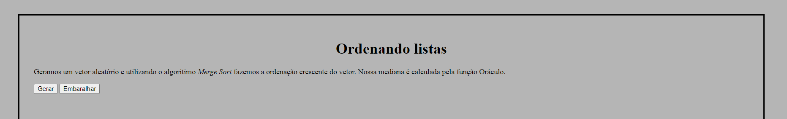
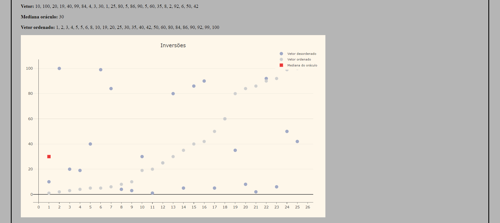
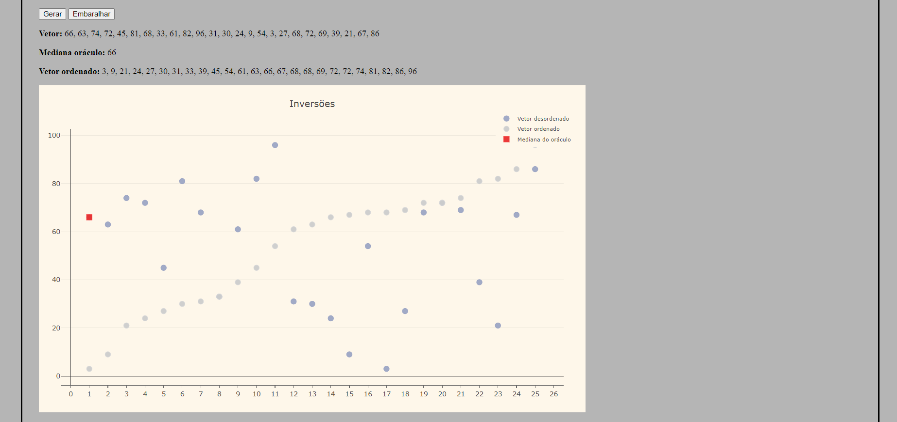

# List Sort

**Número da Lista**: 4<br>  
**Conteúdo da Disciplina**: Dividir e consquistar<br>

## Alunos

**Matrícula** | **Aluno** 
:-----------: | :---------:
16/0022673    | Ailamar Alves Guimarães
17/0080307    | Matheus Amaral Moreira

## Sobre 
Esse projeto visa ordenar um vetor qualquer utilizando os métodos passados nas aulas para a ordenação, além de ter uma função oráculo para tentar advinhar uma mediana ótima e com um gráfico para melhor visualização de como foi a mudança do caso inicial ao estado final do vetor.

## Screenshots





## Instalação 
**Linguagem**: JavaScript <br>

Nosso projeto foi feito em uma pagina HTML.

1. Abra um terminal na pasta que vai ficar os arquivos e faça o clone do repositorio do GitHub para sua máquina:
```
$ git clone https://github.com/projeto-de-algoritmos/DC_ListSort.git
```

2. Vá na pasta 'main' dentro de 'front-end' do repositório e abra o index.html

## Uso 
Temos dois botões: o botão 'Gerar' que vai criar um novo vetor amostral, e o botão 'Embaralhar' que vai embaralhar o amostral, calcular uma mediana a partir da função oráculo, e vai organizar o vetor, para mostar o quão próximo da mediana real o valor achado está.

## Outros 
